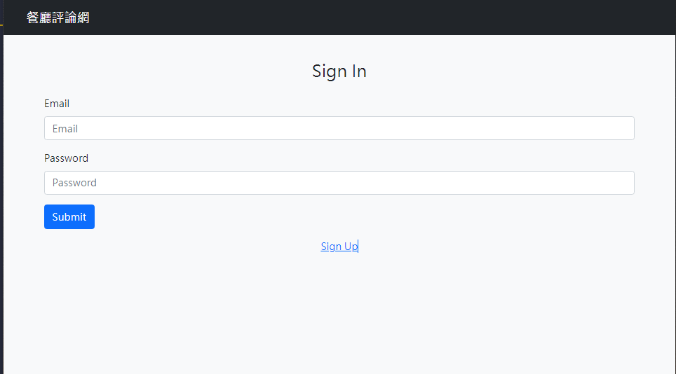

#餐廳論壇
##歡迎來到餐廳論壇，這是一個讓食客分享餐廳體驗、評論和交流的平台。

##如何使用
註冊/登入： 使用你的帳戶註冊或登入論壇。

瀏覽餐廳： 瀏覽論壇上的各種餐廳主題。

發表評論： 點擊餐廳主題進入後，你可以在該主題下發表評論，分享你的用餐體驗。

新增餐廳： 如果你發現論壇中缺少某個餐廳，請在論壇上新增一個主題，與其他食客分享。

互動： 對餐廳進行收藏、按讚，形成有趣的交流。

##技術細節

後端： 基於 Express.js 開發，處理用戶請求、管理數據庫。

數據庫： 使用 MySQL 儲存和檢索用戶和餐廳數據。

##貢獻
如果你有任何建議或改進的想法，請隨時提出 issue 或提交 pull request。我們歡迎各種形式的貢獻！

